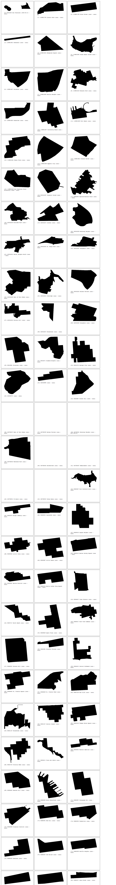
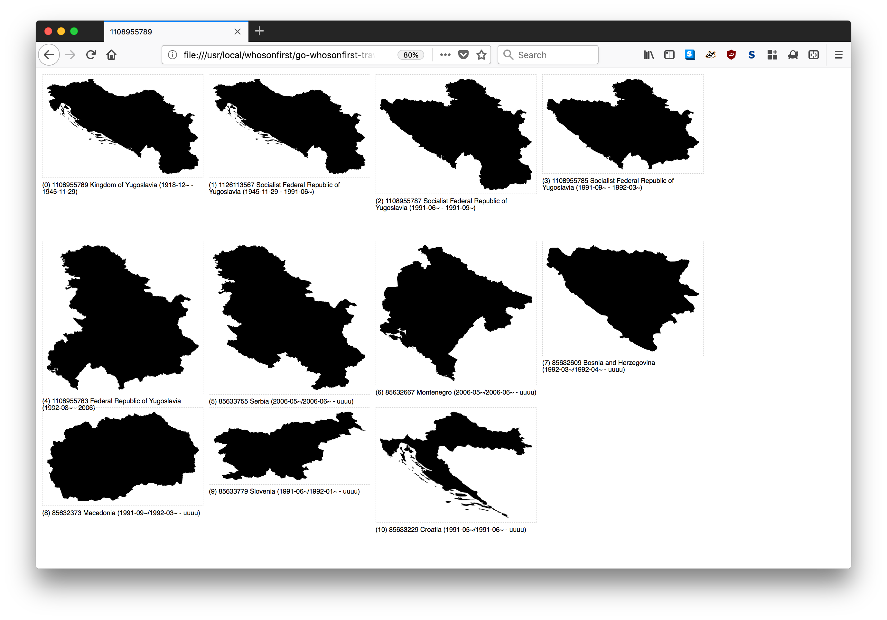
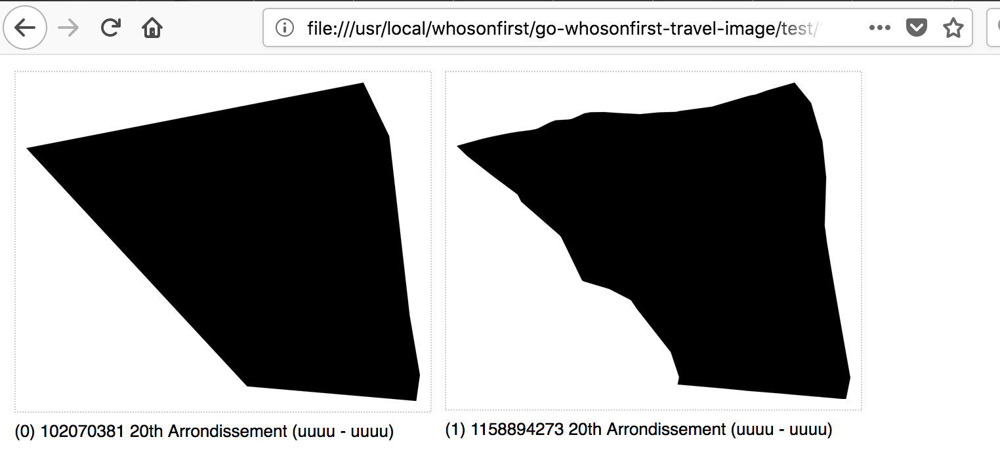
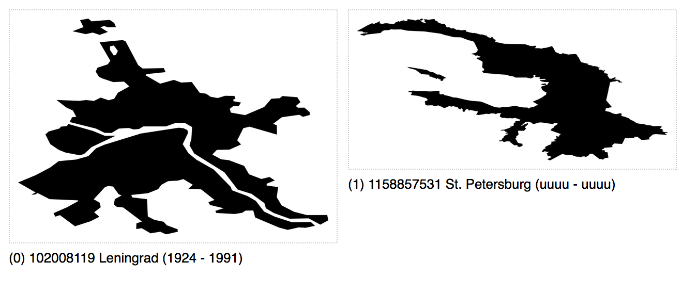

# go-whosonfirst-travel-image

Go package for traveling Who's On First documents and their relations, and making pictures

## Install

You will need to have both `Go` (specifically a version of Go more recent than 1.7 so let's just assume you need [Go 1.9](https://golang.org/dl/) or higher) and the `make` programs installed on your computer. Assuming you do just type:

```
make bin
```

All of this package's dependencies are bundled with the code in the `vendor` directory.

## Important

This should still be considered experimental.

## Tools

Don't get too attached to anything yet. It might all still change...

### wof-belongs-to

```
./bin/wof-belongs-to -labels -html -out ./belongs-to -source /usr/local/data/whosonfirst-data/data -include-placetype neighbourhood -belongs-to 85922583 /usr/local/data/whosonfirst-data

Time passes...
```

Which produces:



### wof-travel-id

```
./bin/wof-travel-id -source /usr/local/data/whosonfirst-data/data -superseded-by -timings -out test -html 1108955789
2018/08/07 17:43:03 time to travel feature ID 85633755 182.121771ms
2018/08/07 17:43:03 time to travel feature ID 85632667 307.617697ms
2018/08/07 17:43:03 time to travel feature ID 1108955783 1.042050504s
2018/08/07 17:43:04 time to travel feature ID 85632609 109.83179ms
2018/08/07 17:43:04 time to travel feature ID 1108955785 1.570722402s
2018/08/07 17:43:04 time to travel feature ID 85632373 147.954674ms
2018/08/07 17:43:04 time to travel feature ID 1108955787 2.255208485s
2018/08/07 17:43:04 time to travel feature ID 85633779 117.256202ms
2018/08/07 17:43:04 time to travel feature ID 85633229 294.142877ms
2018/08/07 17:43:04 time to travel feature ID 1126113567 3.544154652s
2018/08/07 17:43:04 time to travel feature ID 1108955789 4.276219004s
```

Which produces this:



All of the images and HTML output are included in [docs/example/1108955789](docs/example/1108955789)

Other examples:

The "20th" in Paris:



Leningrad and St. Petersburg in Russia:



## See also

* https://github.com/whosonfirst/go-whosonfirst-travel